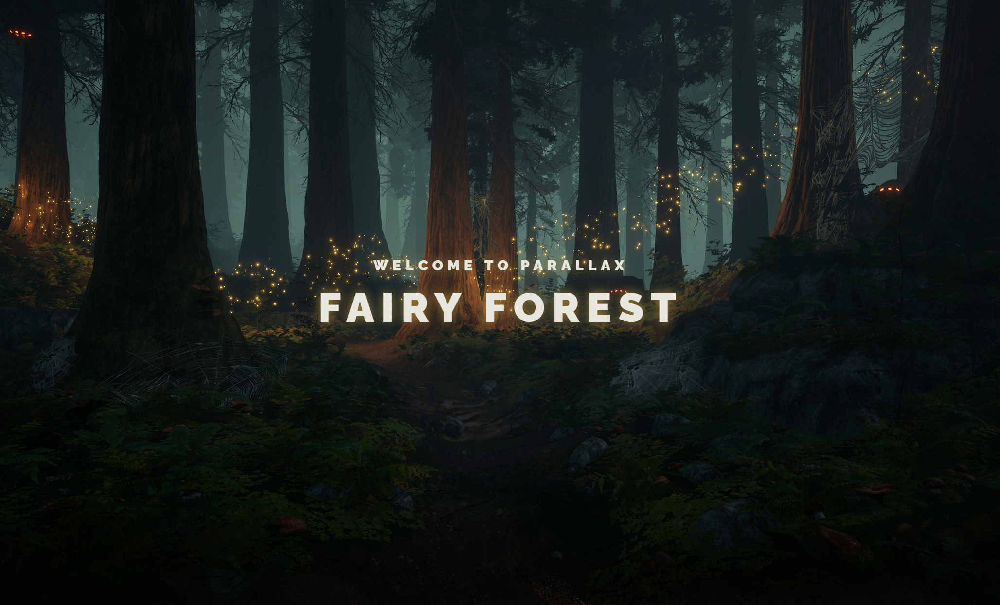
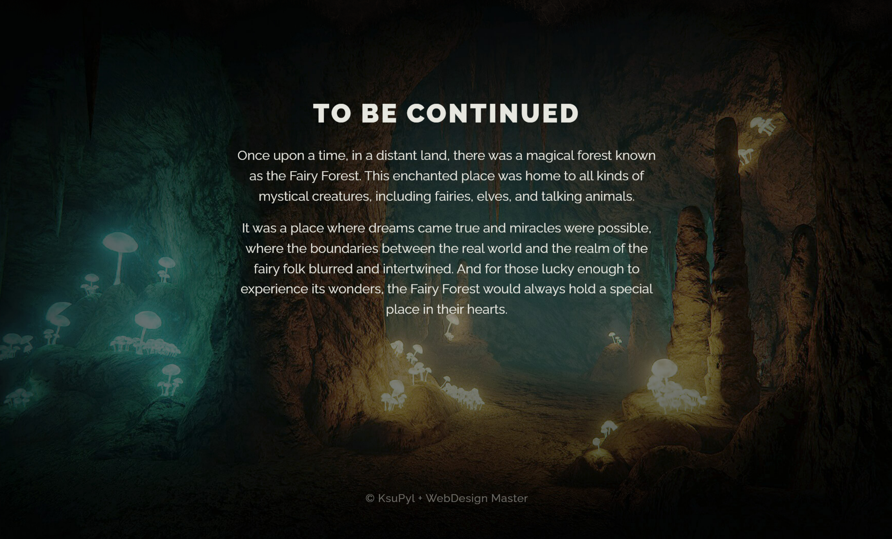

# Fairy_Forest_Parallax_website_portfolio &nbsp;&nbsp;
### Creating a beautiful 3D website with a Parallax scrolling effect.

## :books: Languages, Frameworks and Libraries:
- 
- 

## :hammer_and_wrench: Tools:
- 
- 
- 

## **Demo:** [https://ksupyl.github.io/Fairy_Forest_Parallax_website_portfolio/](https://ksupyl.github.io/Fairy_Forest_Parallax_website_portfolio/) 

